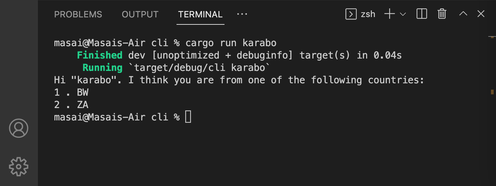

# Predict My Country

Predict My Country is a command line application in Rust, which allow you to enter your name and get a list of countries you are possibly from.

Please read my [blog post](https://www.masaimahapa.co.za/posts/30-days-of-rust-day-12) for better context.

## Usage

```cmd
cargo run <name>
```
Output



## Contributing
Pull requests are welcome. For major changes, please open an issue first to discuss what you would like to change.

Please make sure to update tests as appropriate.
